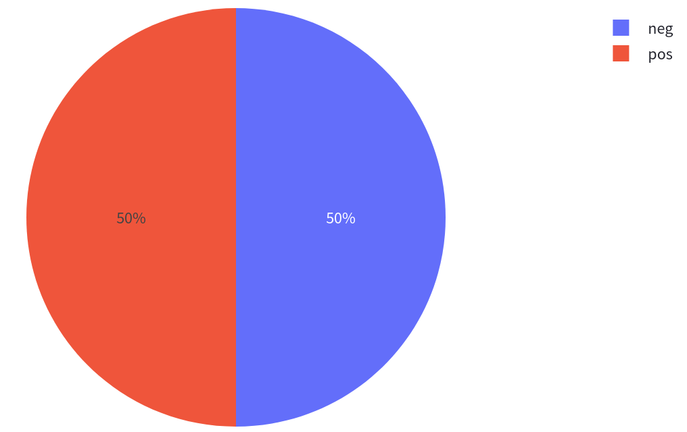
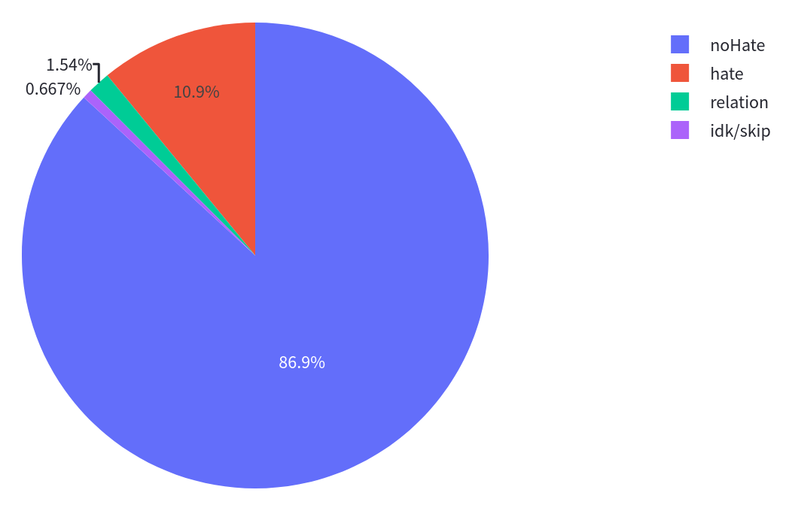

# Considerations for model evaluation

Developing an ML model is rarely a one-shot deal: it often involves multiple stages of defining the model architecture and tuning hyper-parameters before converging on a final set. Responsible model evaluation is a key part of this process, and the 🤗 `evaluate` package is here to help!

Here are some things to keep in mind when evaluating your model using the 🤗  `evaluate` package:

## Properly splitting your data

Many of the datasets on the 🤗 Hub are separated into 2 splits: `train` (used for training models) and `validation` (used for evaluation); others are split into 3 splits: `train`, `validation` and `test` -- in this case, the `validation` split can be used for tuning model hyper-parameters, and the `test` split for the final model evaluation. Make sure to use the right split for the right purpose!

If the dataset you're using doesn't have a predefined train-test split, it is up to you to define which part of the dataset you want to use for training your model and which you want to use for evaluation (since training and evaluating on the same split can misrepresent your results!). Depending on the size of the dataset, you can keep anywhere from 10-30% for evaluation and the rest for testing. Check out [this thread](https://discuss.huggingface.co/t/how-to-split-main-dataset-into-train-dev-test-as-datasetdict/1090) for a more in-depth discussion of dataset splitting!

## The impact of class imbalance

In the case of supervised learning tasks (i.e. tasks for which labels exist), an *imbalance* in the classes can impact evaluation results -- this means that if some classes have much more examples than others, these can impact evaluation results and misrepresent performance.

Often, using more than one metric can help get a better idea of your model’s performance from different points of view. For instance, metrics like **[accuracy](https://huggingface.co/metrics/accuracy)** and **[precision](https://huggingface.co/metrics/precision)** can be used together, and the **[f1 score](https://huggingface.co/metrics/f1)** is actually the harmonic mean of the two.

In cases where a dataset is balanced, using accuracy can be reflect the overall model performance:

In cases where there is an imbalance, using F1 score can be a better representation of performance:

## Offline vs. online model evaluation

Offline model evaluation is any model evaluation that you do using offline data before you deploy a model or use any insights generated from a model.

online model evaluation refers to the process of evaluating how your model is performing after it has actually been deployed and is being used in production.

## Trade-offs in model evaluation

### Interpretability

Not all regression metrics are easy to interpret on their own. For example, it is hard to say what a good value for RMSE is because that depends on the scale of your outcome variable. If your outcome variable ranges from 0 to 1 then a model with a MAE of 0.8 would be considered bad, whereas if your outcome variable ranges from -500 to 500 then a MAE of 0.8 would be considered great. If you want your error metrics to be interpretable out of the box, then you should use error metrics that are scaled to account for the range of your outcome variable such as mean absolute percent error (MAPE).

### Prediction time
Prediction time. One factor that should be considered is the amount of time it takes to make a prediction using your model. This might not be as important if you are using an ad hoc model that only needs to be run once, but if you are building a model that will be used to score data on a regular cadence (whether that be in real time via an API or in batch jobs that run overnight) then you should consider the amount of time it takes to make predictions with your model. Generally, you should favor models that are able to make predictions quicker and with fewer resources.

### Model complexity
